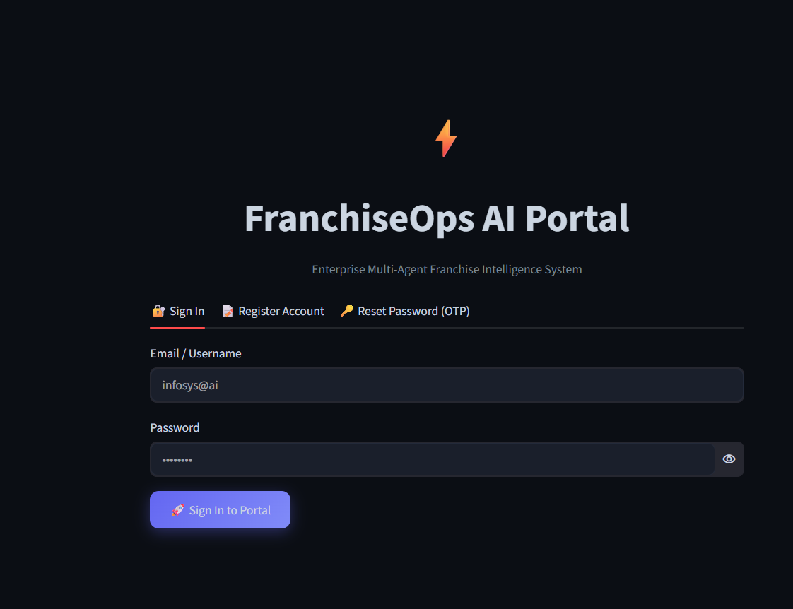
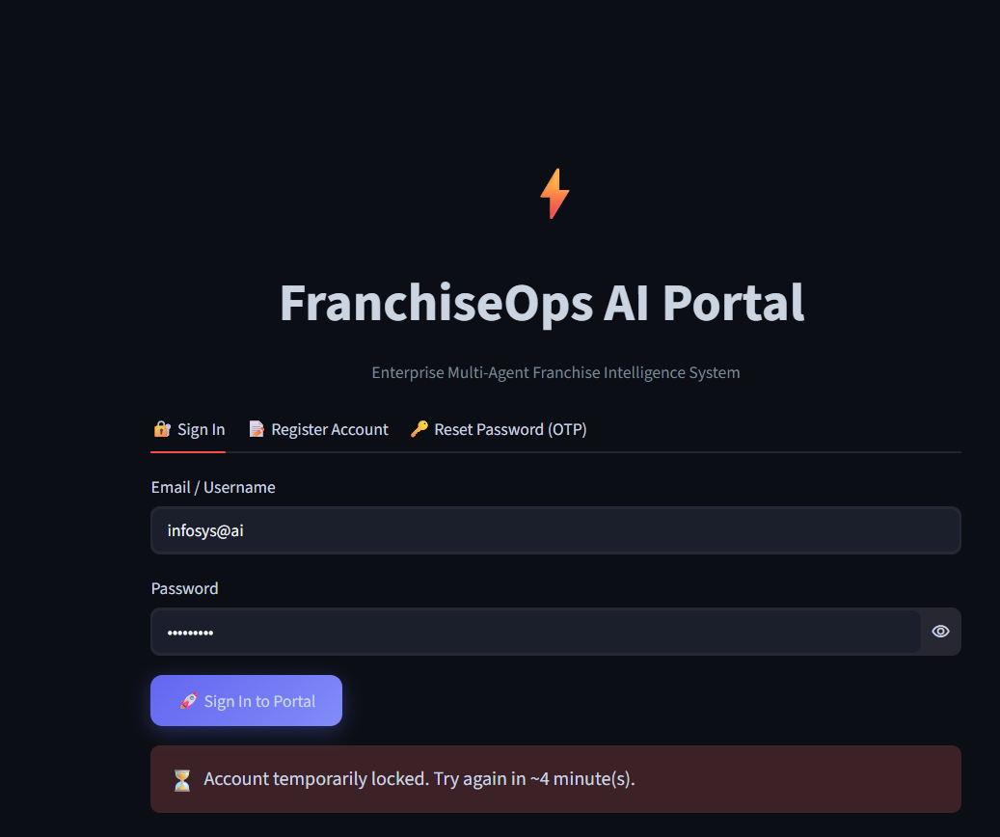
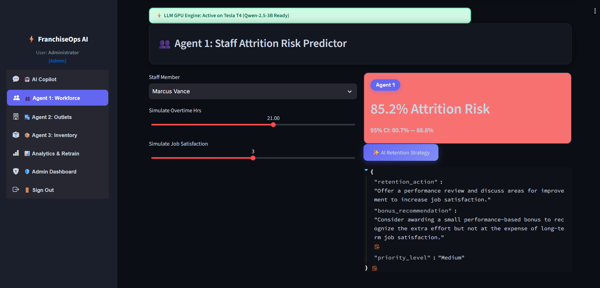
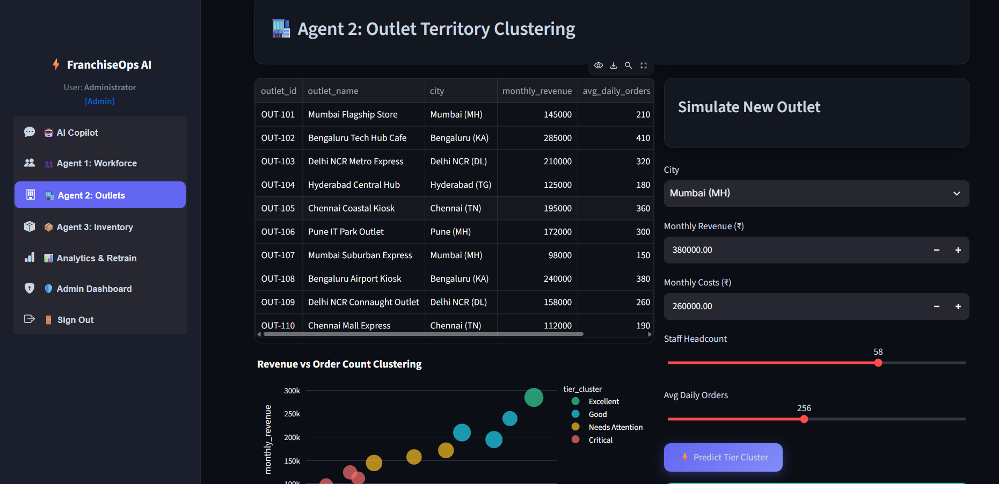
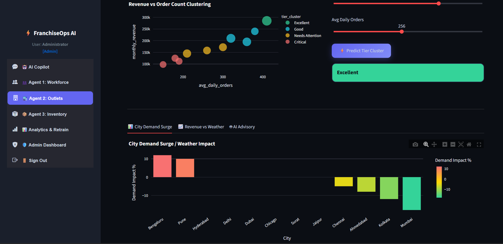
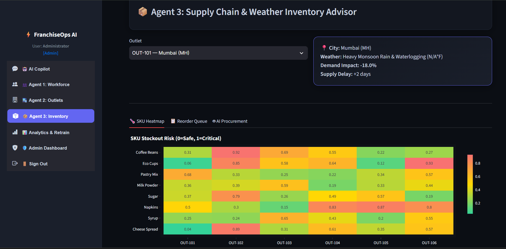
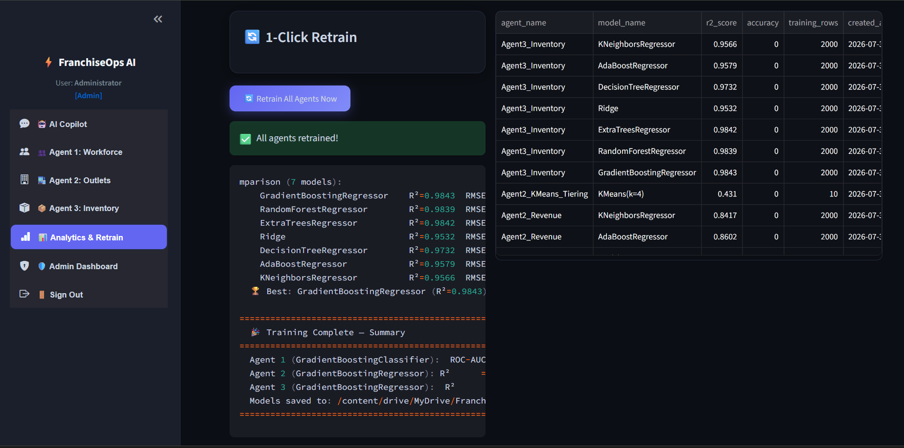
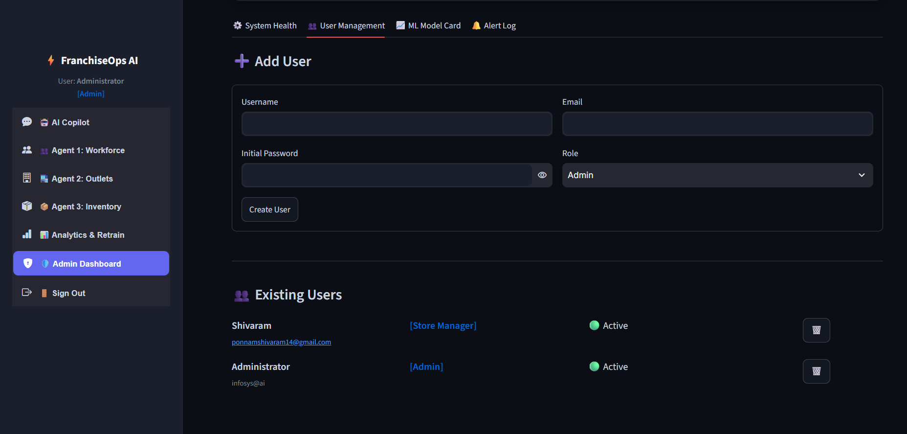

# FranchiseOps AI — Milestone 2
### Full-Stack AI/ML Integration & Advanced Security Engine

## What Milestone 2 adds on top of Milestone 1

Milestone 1 delivered the User Authentication module — JWT session handling, a Streamlit login UI, SQLite-backed
credentials, and Gmail-based OTP verification. Milestone 2 connects that security gateway to the multi-agent ML
core and the LLM Copilot, and adds three hardening layers on top of it:

- **Progressive account lockout** — 3rd failed login → 5 min lock, 4th → 15 min lock, 5th → permanent lock
  (admin unlock only).
- **Dynamic password strength verification** — Weak / Average / Good badge, enforced on both registration and
  password reset.
- **A fully functional Admin Dashboard** — Add User, Delete User, Unlock Account, and an ML Model Card tab
  showing every agent's champion-model metrics.

Each of the 3 ML agents (Workforce Attrition, Outlet Clustering/Revenue, Inventory Demand) trains on its 2
assigned Kaggle datasets and compares 5+ algorithms before a champion model is selected and logged to the
`ml_models` table. Agent 2 additionally drives outlet tiering: the 10 seeded outlets are clustered by average daily
revenue and order count into 4 tiers (Excellent / Good / Needs Attention / Critical) via KMeans.

## Tech stack

| Layer | Technology |
|---|---|
| UI | Streamlit (dark-mode dashboard theme) |
| Auth | bcrypt password hashing, PyJWT session tokens, Gmail SMTP OTP |
| Database | SQLite |
| ML | scikit-learn — 7 algorithms per agent (Logistic/Random Forest/Gradient Boosting/SVC/Decision Tree/AdaBoost/KNN for classification; Random Forest/Gradient Boosting/Extra Trees/Ridge/Decision Tree/AdaBoost/KNN for regression), KMeans clustering |
| LLM Copilot | Qwen2.5-3B-Instruct, 4-bit NF4 quantization via bitsandbytes, HuggingFace Transformers |
| Tunneling | pyngrok |
| Data | Kaggle (`kagglehub.dataset_download`) — 6 datasets, 2 per agent |

## System architecture — 4 phases

| Phase | Module | Responsibility |
|---|---|---|
| Phase 1: Security Gateway | `auth.py`, `db.py` | Login, Registration, Forgot Password (Gmail OTP) gate the entire UI. Hashed credentials and lockout state live in the SQLite `users` table. |
| Phase 2: Domain Intelligence | `agent2_franchise.py`, `agent3_franchise.py`, Agent 1 tab in `app.py` | Agent 1 (Workforce Attrition), Agent 2 (Outlet Clustering/Revenue), Agent 3 (Inventory & Weather Demand). |
| Phase 3: Generative Advisory | `llm_engine_franchise.py` | Synthesizes the 3 agents' numerical outputs into executive retention plans and a structured JSON ERP action via the Copilot's "Generate ERP Action" button. |
| Phase 4: System Administration | `admin_dash.py` | Add/Delete/Unlock users and the ML Model Card tab, restricted to `role = 'Admin'`. |

## Retail city coverage (10 seeded outlets across 6 hubs)

| City | Outlets seeded |
|---|---|
| Mumbai | OUT-101 (Flagship Store), OUT-107 (Suburban Express) |
| Delhi NCR | OUT-103 (Metro Express), OUT-109 (Connaught Outlet) |
| Bengaluru | OUT-102 (Tech Hub Cafe), OUT-108 (Airport Kiosk) |
| Hyderabad | OUT-104 (Central Hub) |
| Chennai | OUT-105 (Coastal Kiosk), OUT-110 (Mall Express) |
| Pune | OUT-106 (IT Park Outlet) |

## Kaggle datasets (2 per agent — Section 7.1)

| Agent | Dataset | Kaggle slug | Target file |
|---|---|---|---|
| Agent 1 | IBM HR Analytics Attrition | `pavansubhasht/ibm-hr-analytics-attrition-dataset` | `WA_Fn-UseC_-HR-Employee-Attrition.csv` |
| Agent 1 | Human Resources Dataset v14 | `rhuebner/human-resources-data-set` | `HRDataset_v14.csv` |
| Agent 2 | Superstore Sales Final | `vivek465/superstore-dataset-final` | `Sample - Superstore.csv` |
| Agent 2 | Sample Store Retail Data | `kyanyoga/sample-store-data` | `store_data.csv` |
| Agent 3 | Retail Inventory Management | `pratyushraj1/retail-inventory-management-dataset` | `inventory.csv` |
| Agent 3 | Web Store Item Demand Forecasting | `shashwatwork/web-store-item-demand-forecasting-dataset` | `train.csv` |

Datasets are pulled via `kagglehub.dataset_download()`. If Kaggle credentials aren't configured (or a dataset
requires accepting its rules on kaggle.com first), `train_m2_franchise.py` falls back to clearly-labeled synthetic
data for that agent rather than failing — check the training console output to see which mode a given run used.

## Setup — Colab Secrets & Kaggle API (Sections 3–4)

1. **Runtime → Change runtime type → T4 GPU → Save.** Run `!nvidia-smi` as the first cell to confirm the GPU is attached.
2. **Kaggle API token (recommended):** kaggle.com → profile → Settings → API → *Create New Token* → downloads `kaggle.json` containing your `username` and `key`.
3. **Colab Secrets:** click the key icon in the left sidebar and add each secret below, toggling "Notebook access" ON:

| Secret | Purpose |
|---|---|
| `JWT_SECRET_KEY` | Signs/verifies login session tokens (any random string) |
| `ADMIN_EMAIL_ID` | Bootstraps the admin account (fallback: `infosys@ai`) |
| `ADMIN_PASSWORD` | Bootstraps the admin account (fallback: `admin@123`) |
| `NGROK_AUTHTOKEN` | Public HTTPS URL for the Streamlit app |
| `HF_TOKEN` | HuggingFace auth for Qwen2.5-3B (4-bit) Copilot inference |
| `EMAIL_ID` / `EMAIL_PASSWORD` | Gmail SMTP sender for OTP/alerts (optional — console fallback works without it) |
| `KAGGLE_USERNAME` / `KAGGLE_KEY` | From `kaggle.json` — trains Agent 1 on real IBM HR data instead of synthetic |

## How to run

1. Open `FranchiseOps_AI_Milestone2.ipynb` in Colab, set the GPU (above).
2. Run every cell top to bottom: install deps -> secrets/Drive mount -> GPU check -> write all modules
   (`auth.py`, `db.py`, `ui_theme.py`, `admin_dash.py`, `train_m2_franchise.py`, `llm_engine_franchise.py`, etc.)
   -> init DB + seed data -> `train_all_agents()` -> write `app.py` -> launch via ngrok.
3. Open the printed ngrok URL and sign in with `ADMIN_EMAIL_ID` / `ADMIN_PASSWORD`.

## Screenshots

All images below are loaded directly from the `screenshots/` folder next to this README. As long as each file
exists at the exact path shown under its heading, GitHub will render it inline automatically when this README
is viewed on the repository page — no extra setup needed.

### Home
KPI overview shown immediately after login.

### Locking
Progressive account lockout — a triggered lockout message after repeated failed login attempts, and the OTP
resend cooldown message.

### Agent1
Agent 1 — Workforce Attrition prediction (age, satisfaction, overtime, tenure, income, work-life balance).

### Agent2
Agent 2 — Outlet Territory Clustering: simulate a new outlet's revenue and order count, and predict its
KMeans tier (Excellent / Good / Needs Attention / Critical).

### Agent3
Agent 3 — Inventory & Weather Demand: SKU stockout risk and weather-driven demand impact.

### Analytics
AI Copilot / Analytics view — prompt and synthesized response (Ask Copilot, Debate View, or Generate ERP Action).

### Admin
Admin Dashboard — System Health, User Management (Add/Delete/Unlock), and ML Model Card tabs.

